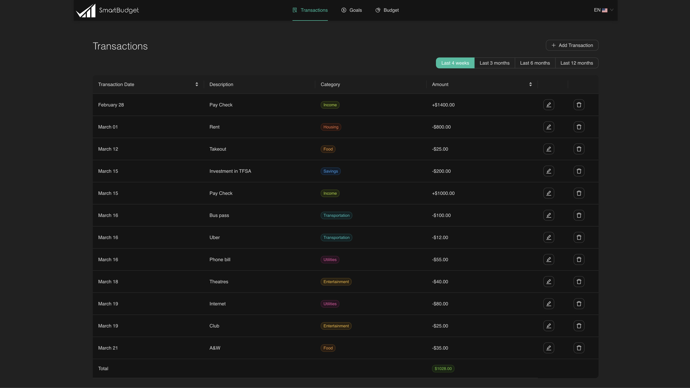
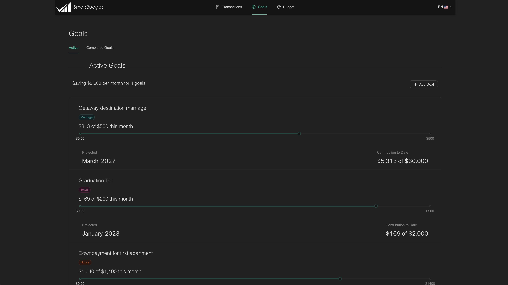
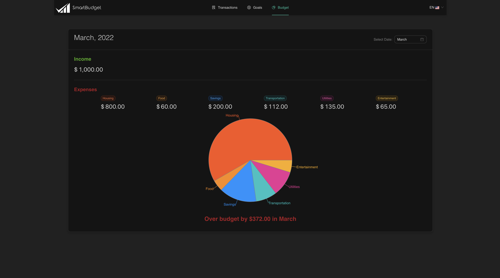

# SEG 3125 - Lab 9

## Smart Budget

SmartBudget is a budgeting app which allows users to track their income, spending, and progress towards goals. Using this information, SmartBudget creates expense breakdowns and provides analytics. Includes bilingual support in both English and French.

## Demo

Transactions

Goals

Budget

